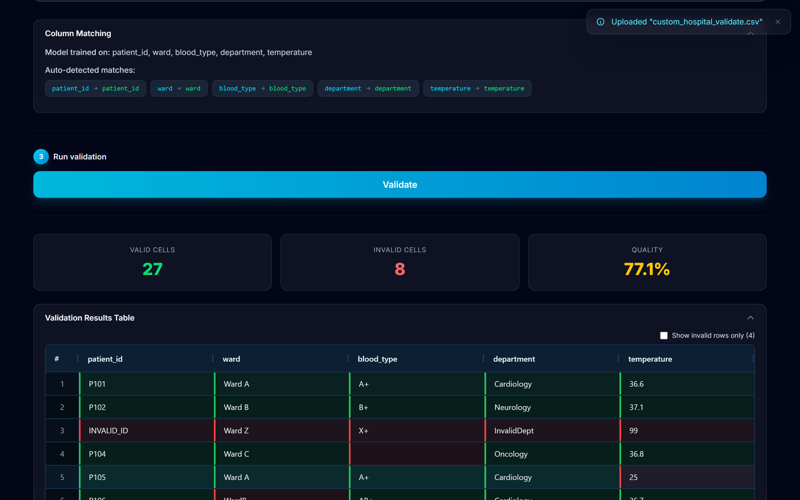
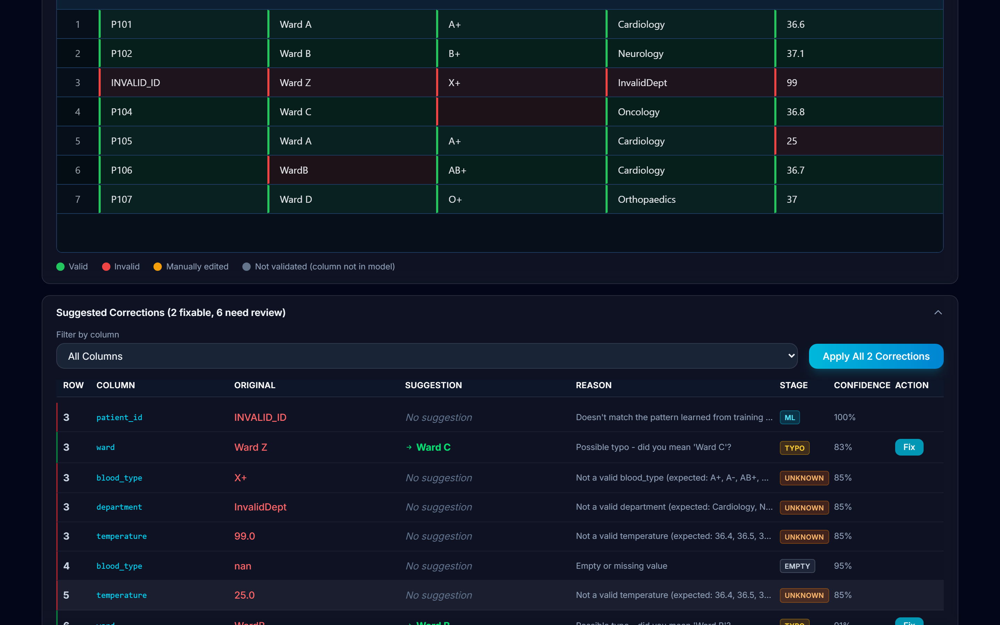

# ML Data Validator

**Clean data that never leaves the building.**

A machine learning-based data validation and correction tool. Upload a CSV, train a custom model on your data, and the system highlights invalid cells, explains why they're wrong, and suggests corrections — all running fully offline with no external API calls.

## Who it's for

Teams whose data is too sensitive for the cloud. A clinical research coordinator gets a 2,000-row patient export every week, typed by six people across three sites. Reviewing it in Excel takes hours and misses things; pasting it into a chatbot is a PDPA breach the moment they hit enter. This tool is the third option: train it on ~50 clean rows of your own data, and it learns each column's shape — categorical values, numeric ranges, ID patterns — then flags what doesn't belong, explains which check caught it, and suggests the fix. Every change is recorded in an exportable audit log.

*The full go-to-market narrative lives in [docs/product_storyboard.html](docs/product_storyboard.html) — a nine-frame storyboard from problem to positioning.*

## Screenshots

**Validation results** — every cell colour-coded, quality metrics at a glance, one row of planted errors caught:



**Suggested corrections** — each flag shows the pipeline stage that caught it (rule / typo / unknown / ML / empty), the reason, confidence, and a one-click fix where a correction exists:



## Positioning

| | Learns from your data | Suggests fixes | Fully offline |
|---|---|---|---|
| Excel + eyeballs | ✗ | ✗ | ✓ |
| Rule engines (Great Expectations, Pandera…) | ✗ | ✗ | ✓ |
| Cloud LLM tools | few-shot only | ✓ | ✗ |
| **ML Data Validator** | **✓** | **✓** | **✓** |

## Measured results

- **5/5 planted errors caught, zero false positives** on the benchmark demo (100 retail orders, 5 injected errors across 700 cells)
- **~2 seconds** to validate what takes 15–30 minutes of manual review
- **53 automated tests** plus a live end-to-end API integration suite
- **0 bytes** of user data sent anywhere, ever — the server binds to localhost only

### Precision-first by design

False positives destroy trust faster than false negatives — a reviewer who sees valid cells painted red stops believing the red. The pipeline is built around that:

- **Deterministic stages produce no false positives by construction.** A value rejected by a rule (negative age), a closed set (unknown ward), or a learned range genuinely violates that check. The one caveat: "valid" is defined by *your training data* — a legitimate new category that wasn't in the training sample will be flagged as unknown. The fix is data, not code: add it via "Add data to existing model."
- **The ML stage only flags at ≥65% confidence.** Borderline "maybes" pass rather than alarm. This deliberately trades a little recall for precision on open-ended columns (names, addresses), where unusual-but-valid values are common.

So "zero false positives" is the measured result on the benchmark datasets and the design target — not a universal guarantee. Real-world precision depends on how representative your training sample is, which is why training on your own data is the core workflow rather than an optional extra.

---

## Quick Start

**One command** (serves the whole app on a single URL):
```bash
cd frontend && npm run build && cd ..   # first time only
python run.py
```

Open **http://localhost:8000** in your browser.

<details>
<summary>Development mode (hot reload)</summary>

Run the API and the Vite dev server side by side — Vite proxies `/api` to port 8000:

```bash
python run.py              # terminal 1: API on :8000
cd frontend && npm run dev # terminal 2: UI on http://localhost:5173
```
</details>

---

## How It Works

### Validate Tab
1. Upload a CSV file
2. Select a model (base model or a custom trained model)
3. Click **Run Validation** — invalid cells highlight red, valid cells green
4. Review suggested corrections in the panel below (with reason + confidence score)
5. Apply corrections individually or all at once — every flagged cell shows *which pipeline stage* caught it (rule / typo / range / ML) and why
6. Export the cleaned CSV, a summary quality report, and an **audit log** recording every cell change (timestamp, original value, new value, source)

### Train Tab
1. Upload a CSV with your valid data (all rows treated as valid examples)
2. Give the model a name and click **Train**
3. The system auto-generates synthetic invalid examples **matched to each column's type** — realistic typos for categorical columns, entry errors (shifted decimals, negatives) for numeric columns, structural corruption for open-ended text — and trains a Logistic Regression classifier per column
4. View per-column accuracy, F1 score, and GridSearchCV tuning results
5. Saved model appears in the model list — ready to use for validation

---

## Architecture

```
frontend/          React + Vite + TypeScript + Tailwind CSS + AG Grid
backend/           FastAPI (Python) — REST API + SSE streaming
ml/                scikit-learn ML core (no LLM, fully offline)
models/            Trained .pkl model files
training_data/     Base training CSV (544 rows, 7 columns)
reference_lists/   Valid value lists (country, gender, currency, etc.)
tests/             49 pytest unit + regression tests
test_data/         Demo CSVs and API integration test
```

**Validation pipeline per cell** (one shared code path — every verdict carries the stage that produced it and a human-readable reason):
1. **Empty check** — missing/NaN values flagged explicitly
2. **Deterministic rules** — resolved on whole column-name tokens, so `customer_email` gets email rules but `mailing_address` does not (age 0–120, email format, ≥7 phone digits, no negative amounts…). Well-formed emails and phone numbers short-circuit as valid — a structurally perfect value is never flagged by the ML.
3. **Whitelist match** — exact + numeric normalisation (`95` == `95.0`)
4. **Learned numeric range** — continuous numeric columns reject values far outside the range seen in training
5. **Fuzzy typo detection** — categorical/reference-list columns only (best match ≥80% similarity via rapidfuzz), with the intended value suggested
6. **Closed-set rejection** — unknown values in categorical/reference-list columns are invalid (no ML guessing)
7. **ML classifier** — Logistic Regression over char n-gram TF-IDF + shape-token n-grams (`P101` → `xddd`, both learned per column) + structural features, GridSearchCV-tuned. Flags only when P(invalid) ≥ 65% — precision over recall, so borderline "maybes" never paint a cell red.

**Correction engine:** best-match fuzzy search (`rapidfuzz`) against the column's valid examples, with per-type thresholds (85% for phone/email, digit-count checks for phones, no suggestions for numeric columns). Deterministic and fast — no ML at correction time.

---

## Base Model Columns

The pre-trained `base_model.pkl` validates these columns (auto-matched by name):

| Column | Validation Type | Notes |
|--------|----------------|-------|
| `name` | ML classifier | Names across cultures, hyphenated |
| `email` | ML + rules | Must have `@`, valid domain |
| `phone` | ML + rules | Minimum 7 digits, various formats |
| `country` | Reference list | 143 countries + abbreviations |
| `age` | Numeric bounds | 0–120, no negatives |
| `address` | ML classifier | Structural patterns |
| `blood_sugar` | Numeric bounds | 0–500 |

---

## Custom Models

Train on any CSV domain (HR, retail, hospital, etc.). The system automatically:
- Detects **categorical columns** (e.g. `department`, `ward`, `blood_type`) and applies whitelist-only validation
- Uses the **ML classifier** for open-ended and high-cardinality columns (e.g. `order_id`, `customer_name`)
- Tunes regularisation parameter **C** via GridSearchCV over `[0.01, 0.1, 1.0, 10.0, 100.0]`

To improve a model, add more representative rows via **"Add data to existing model"** — new valid values extend the whitelists and the classifiers retrain on the combined data.

---

## Testing

```bash
# Unit + regression tests (49 tests)
pytest tests/ -v

# End-to-end API integration test covering upload, validation, training,
# exports and the file-size guard (requires server on port 8765)
python test_data/run_api_test.py
```

---

## Demo Datasets

| File | Description |
|------|-------------|
| `training_data/custom_retail_training.csv` | 300-row retail orders training data |
| `test_data/custom_retail_validate.csv` | 100-row retail data — the 5 injected errors are flagged with zero false positives |
| `training_data/custom_employee_training.csv` | HR employee training data |
| `test_data/custom_employee_validate.csv` | 10-row employee data with an injected negative salary |
| `training_data/custom_hospital_training.csv` | Hospital patient training data |
| `test_data/custom_hospital_validate.csv` | Patient data with invalid ward, blood type, department and temperatures — all flagged |

---

## Security & Compliance

- All processing runs locally — no data leaves the machine (privacy by design; suitable for PDPA/healthcare data)
- **Audit trail** — every cell change is recorded (timestamp, row, column, original, new value, source) and exportable as CSV
- CORS restricted to `localhost:5173` only
- CSV-only uploads with 10MB size limit
- Pydantic schema validation on all API request bodies
- Base model protected from deletion

---

## Tech Stack

| Layer | Technology |
|-------|-----------|
| Frontend | React 18, Vite, TypeScript, Tailwind CSS, AG Grid |
| Backend | FastAPI, Pydantic, uvicorn |
| ML | scikit-learn, pandas, joblib |
| Correction | `rapidfuzz` fuzzy matching |
| Testing | pytest |
